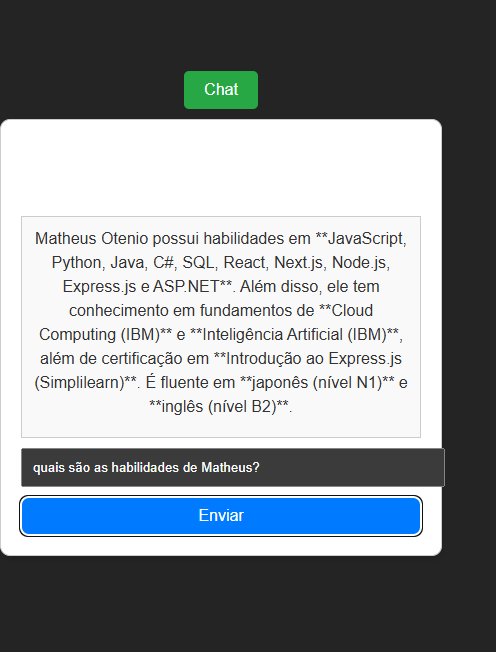

# Assistente Virtual com Deepseek R1  

## Descrição  
Este projeto utiliza React + Vite para criar um assistente virtual baseado na API Deepseek R1, permitindo que visitantes obtenham informações sobre o meu perfil de forma interativa e dinâmica.  

---

## Tecnologias Utilizadas  
- **Frontend:** React, Vite  
- **API:** Deepseek R1  

## Imagem do Projeto  
  

---

## Como Executar  

1. Clone o repositório:  
```sh
git clone https://github.com/MatheusOtenio/AssistenteVirtual.git  
cd AssistenteVirtual  
```

2. Instale as dependências:  
```sh
npm install  
```

3. Configure a API Key da Deepseek R1:  
   - Crie um arquivo `.env` na raiz do projeto  
   - Adicione a variável de ambiente:  
```env
VITE_DEEPSEEK_API_KEY=SUA_CHAVE_AQUI  
```

4. Inicie o projeto:  
```sh
npm run dev  
```

---

## Funcionalidades  
- Interação dinâmica com visitantes  
- Respostas personalizadas com base no meu perfil  
- Consumo da API Deepseek R1 para geração de respostas inteligentes  

---

## Conclusão  
Este projeto demonstra a integração de React, Vite e Deepseek R1, criando um assistente virtual eficiente e interativo para apresentação de perfil.  
